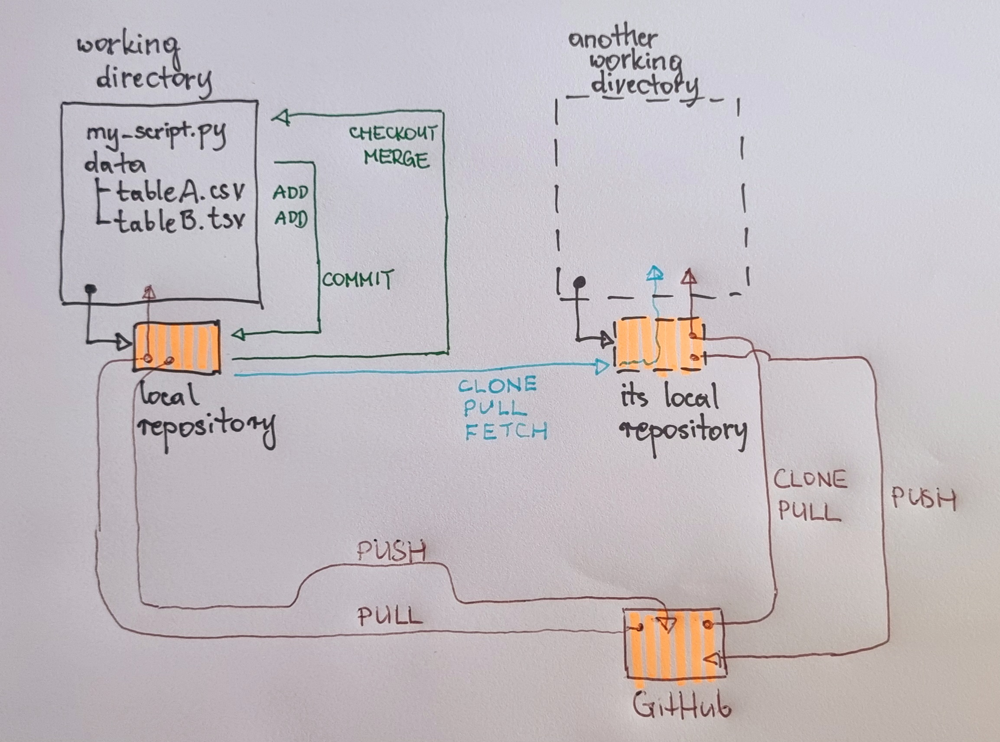

# Projects, git, github intro

## A typical data science project

- multiple files with data analysis scripts
- development takes time - scripts evolve and have multiple versions
- growing - multiple directories/subdirectories after some time
- multiple files with data (but note: large files or files with sensitive content require different handling)
- self-shared (e.g. developed on a laptop and on a desktop machine)
- shared development with other contributors (programmers, supervisors, etc.)
- different states (snapshots) of the project exist on different computers

## Git

- "Git is a free and open source distributed version control system designed to handle everything from small to very large projects with speed and efficiency."
- https://git-scm.com/
- Git is a tool for tracking changes in files and directories. It organizes a repository: a "database" which keeps history of changes in a project. Git detects which project files were changed/added/removed and it knows how to memorize these changes in the project repository. But Git is not the tool to edit/visualize/analyze the files - for this purpose we use other tools (e.g. text editors, Python, R, etc.).

## GitHub

GitHub is a cloud-based web service where users can store, share and visualize their Git repositories. 

Some example repositories:

- Materials of this course are hosted at GitHub, at the following location: https://github.com/LUMC/EfDS
- Another course which we developed with help of GitHub; the course has a longer development history:
  - The source code/materials are here: https://github.com/LUMC/rcourse
  - The web pages served by GitHub based on the sources: https://lumc.github.io/rcourse/
- Many python related repositories: https://github.com/python

## First steps with Git

First directory and first repository:

- Let's assume that you have a project. All files of the project are located in a directory (possibly with subdirectories).
- First, a new Git **local repository** needs to be `initialized` for the project directory. In Git terminology the project directory is now called **working directory**. From now on, it will be possible to track changes in project files.
- Changes are not tracked automatically. For each file which you want to track, you need to execute Git `add` command. Later, when you execute Git `commit` command, a snapshot of all previously added files will be stored in the local Git repository.
- At any moment all committed files can be `checked out` (i.e. recreated in the working directory based on the local repository).

A cloned repository:

- Using data from "the first" repository created above, a new independent working directory for the project can be `cloned`.
- The clone is a new working directory with its own local repository.
- Now, the first repository and the cloned repository will keep independent histories of changes in the files of their own working directories.
- The changes of the histories can be synchronized (`merged`) later.

## Tasks to practice

- Learn how to `clone` the course materials on your computer.

- Create your own account on GitHub.
- Create your first local repository:
    - First create a new directory for Python files developed during this course.
    - Initialize a git repository in this directory (`git init` console/terminal command)
    - Create a `README.md` markdown file with a trivial description of the directory content.
    - Copy a Python notebook file to the directory.
    - Use `git add` commands to declare that the new files should be put to the repository.
    - Use `git commit` command to create a new commit in the repository.
- Create a new repository on GitHub. You will see some instructions how to connect your local repository to the newly created GitHub one.
- Use `git push` to push your committed local repository to GitHub. After this operation you should see new content in GitHub.