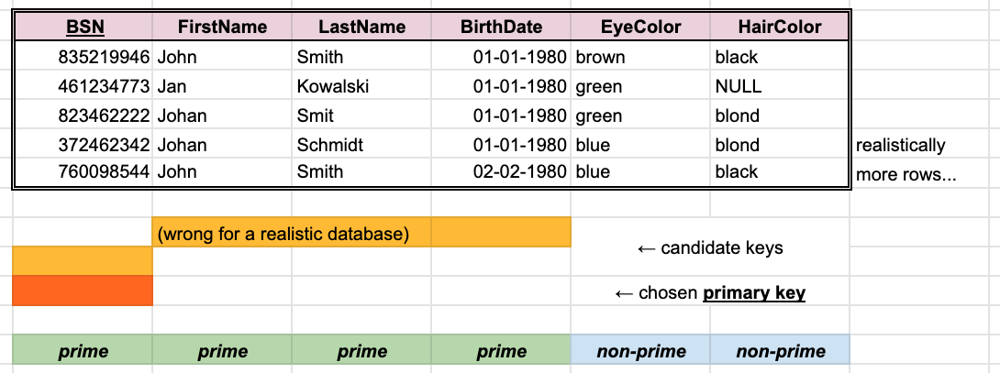

# Keys, primary keys, prime attributes

In a relational database each table must have an attribute (or a set of) uniquely identifying each row.

There are several related terms:

- *superkey:* Any set of columns which has/will-have different values in each row.
- *candidate key:* A minimal superkey; such a set of columns that when a column is removed then there are/will-be duplicate rows. A table might have several candidate keys.
- <u>*primary key:*</u> A chosen candidate key. The column names of a table primary key are often shown underlined.

A key is *composite* if it contains more than one column.

For a particular table and its candidate keys:

- *prime attribute:* a column belonging to any candidate key
- *non-prime attribute:* does not belong to any candidate key

*Observation:* a DBMS can generate a column (often named `id`) with values guaranteed to be unique.
