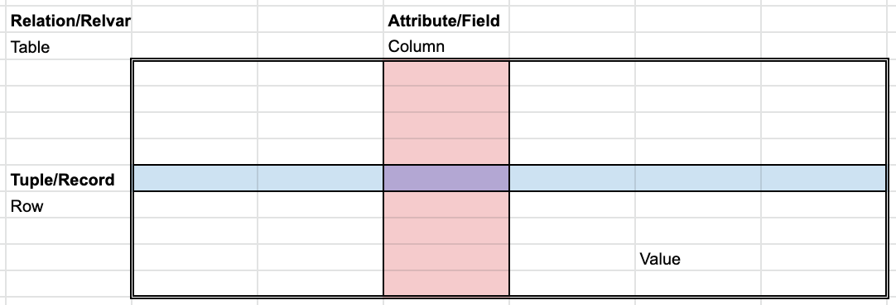

# Relation/Table

This is a general structure and naming conventions of a [relational database relation/table](https://en.wikipedia.org/wiki/Relation_%28database%29).

Mixed naming conventions:

- Tuple/record (rel. db.) = row (SQL) = observation (R/tidyverse).
- Attribute/field (rel. db.) = column (SQL) = variable (R/tidyverse).
- Relation (rel.db) = table (SQL).

Table:

- Table is a set of records (in rows).
- Rows and columns have no particular order (there are no row numbers).
- Each column has a name unique within the table.
- Each column keeps data from one domain (of one elementary type; e.g. integers).
- Each row is different (related to the concept of key).
- Each table has a name (unique within the database).
