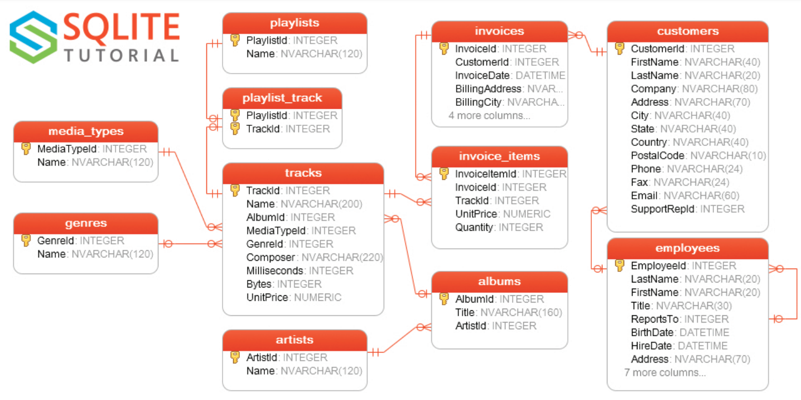

# Column data types and constraints

## A fragment of (re)create table code for the example database

Study the diagrams of relations with respect to the fragment of [the SQL code](https://raw.githubusercontent.com/lerocha/chinook-database/master/ChinookDatabase/DataSources/Chinook_Sqlite.sql) recreating the Chinook database `Track` table (the structure and some content):



```sql
DROP TABLE IF EXISTS [Track];

CREATE TABLE [Track]
(
    [TrackId] INTEGER  NOT NULL,
    [Name] NVARCHAR(200)  NOT NULL,
    [AlbumId] INTEGER,
    [MediaTypeId] INTEGER  NOT NULL,
    [GenreId] INTEGER,
    [Composer] NVARCHAR(220),
    [Milliseconds] INTEGER  NOT NULL,
    [Bytes] INTEGER,
    [UnitPrice] NUMERIC(10,2)  NOT NULL,
    CONSTRAINT [PK_Track] PRIMARY KEY  ([TrackId]),
    FOREIGN KEY ([AlbumId]) REFERENCES [Album] ([AlbumId])
		ON DELETE NO ACTION ON UPDATE NO ACTION,
    FOREIGN KEY ([GenreId]) REFERENCES [Genre] ([GenreId])
		ON DELETE NO ACTION ON UPDATE NO ACTION,
    FOREIGN KEY ([MediaTypeId]) REFERENCES [MediaType] ([MediaTypeId])
		ON DELETE NO ACTION ON UPDATE NO ACTION
);

INSERT INTO [Track] (
    [TrackId], [Name], [AlbumId], [MediaTypeId], [GenreId],
    [Composer], [Milliseconds], [Bytes], [UnitPrice]
  ) VALUES (
    1, 'For Those About To Rock (We Salute You)', 1, 1, 1,
    'Angus Young, Malcolm Young, Brian Johnson', 343719, 11170334, 0.99
  );
```

## Column data types

In a relational database a type of data which are kept in a column needs to be specified.  
Some data types are generally supported by many relational database managements systems. Have a look at [w3schools tutorial](https://www.w3schools.com/sql/sql_datatypes.asp) for a broad list or at [SQLite Tutorial Data Types](https://www.sqlitetutorial.net/sqlite-data-types/) for types supported by SQLite.

Common data types:
  - `CHAR(n)`: a text of a *fixed* length of `n` (8-bit) characters
  - `VARCHAR(n)`: a text of a *variable* length with a maximum set to `n` (8-bit) characters
  - `TEXT(n)`: similar to `VARCHAR(n)`
  - `ENUM(v1,v2,v3)`: a categorical variable, one of `v1`, `v2`, ...
  - `BOOL`: `0` represents `FALSE`, non-`0` represents `TRUE`
  - `INT(size)`: an integer number of `size` digits
  - `NUMERIC`: a decimal number
  - `DECIMAL(size,d)`: a decimal number of `size` digits total, `d` after comma
  - `DATE`: date (in format `YYYY-MM-DD`)
  - `DATETIME`: date and time (in format `YYYY-MM-DD HH:MM:SS.SSS`)

## Column data constraints

There are several constraints which can be specified for a column (or several columns):
  - `PRIMARY KEY`: Declares that a column is the primary key (or is a part of a composite primary key).
  - `AUTOINCREMENT`: Declares that a value in the column will keep increasing when new row is entered.
  - `NOT NULL`: Declares that `NULL` values are not allowed in this column and a change to `NULL` value will raise an error.
  - `FOREIGN KEY`: Allows to specify that a column contains references to a primary key column in another table (also works for several columns in case of a composite key). Moreover, it is possible to specify what should happen with a row when the referenced row gets deleted or updated.
