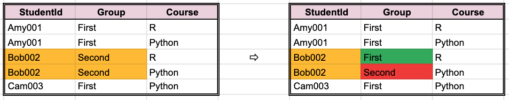
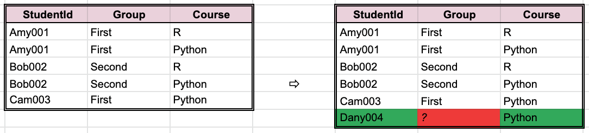
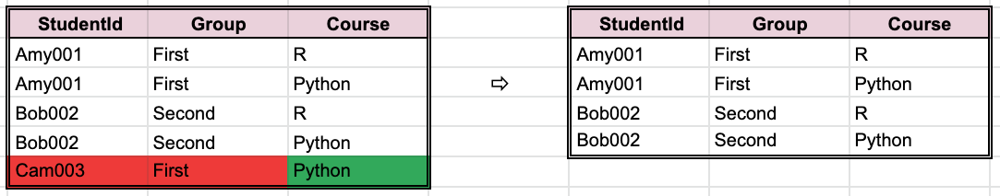
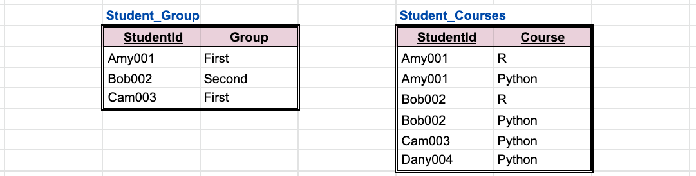

# Database design anomalies

Bad design of a database structure may lead to difficulties with implementing operations modifying (update, insert, delete) the database content.

Let's consider the following examples assuming that a student should always belong to exactly one group and that a student may be registered to any number (0,1,2...) of courses.

## Update (modify) anomaly

*Problem:* Same information is kept in multiple rows.  
*Example:* Changing a `Group` of a student may require updates in multiple rows. When such change is only partially successful data become inconsistent.

## Insert anomaly

*Problem:* Unrelated information is kept in different columns. Proper adding of a complete row is impossible.  
*Example:* It is impossible to add a student `Dany004` to the `Python` course until the student is assigned to a `Group`.

## Delete anomaly

*Problem:* Unrelated information is kept in different columns. Deleting intended partial information in impossible.  
*Example:* It is impossible to remove the student `Cam003` from the `Python` course without removing the student from the assigned `First` `Group`.

## Anomalies resolved

Splitting unrelated information to separate tables resolves anomalies.  
Database normalisation is a formal description of this process.
