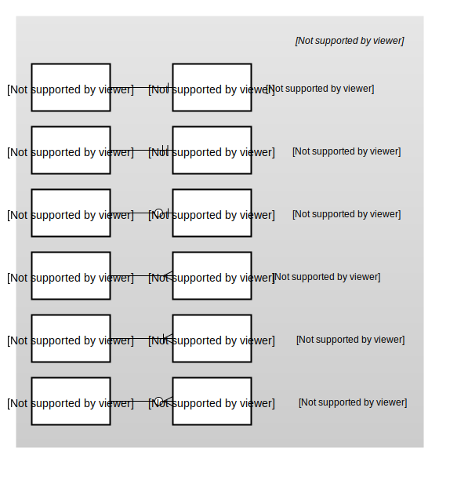
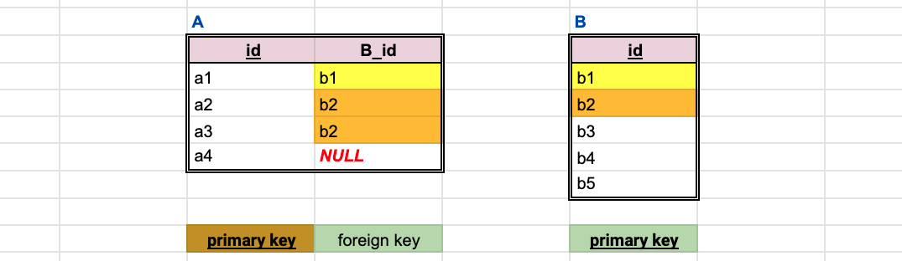
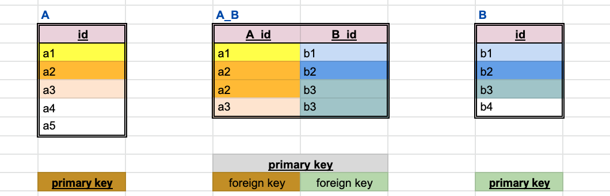

# Relationships between tables (table rows)

In general the following relationships exist between (group of) rows in a first table and (group of rows) in a second table.

## Types of relationships

### one-to-one (and one-to-zero)

*Example*: a *person* has a *passport*:
  - a person has either zero or one passport (never more than one)
  - a passport belongs to exactly one person

### one-to-(m)any or many-to-one

*Example*: a *student* has a *mentor*:
  - a student has exactly one mentor
  - a mentor supervises any number (0,1,2,...) of students

### (m)any-to-(m)any

*Example*: A *student* participates in a *course*:
  - a student participates in any number of courses
  - a course has (m)any participating students

## Diagram notation

## Representation of relationships

A *foreign key* is a column containing values of a *primary key* column of the referred table.

### zero/one-to-(m)any

Let's add to the table A a *single column* of foreign key referring to B.  

Then one A refers to:
  - exactly one B (when the foreign key must not be *NULL*);
  - zero or one B (when the foreign key can be *NULL*).

Zero, one or more B might refer to the same A.

### (m)any-to-(m)any

Let's add a separate *association table* to the database.  
The association table contains *two foreign keys* referring to the tables to be associated.  
*NULL* foreign keys are not allowed in the association table.

## Database schema

A *database schema* defines:
  - tables and relations present in the database
  - fields present in each table
  - constraints that apply to the data
  - physical representation of the data

The schema might be provided in different forms:
  - as code
  - as a schema diagram (entity-relationship) diagram

*Data modeling* is the process of creating a database schema.

## Entity relationships diagram of the example database

Let's study the individual arrows between various entities in the diagram from the [SQLite Sample Database](https://www.sqlitetutorial.net/sqlite-sample-database/):

The following sentences always have the form: *ENTITY-A* RELATION-NAME *ENTITY-B*.

Examples of zero/one-(m)any from the diagram:

  - An *album* is authored by exactly one *artist*. An *artist* authors zero or more *albums*.
  - An *album* contains zero or more *tracks*. A *track* belongs to zero or one *album* (so, the same *track* can't belong to several albums).
  - An *invoice* is always issued to exactly one *customer*. A *customer* might have zero or more *invoices*.

And an example of representation of many-many relationship *invoice*-*track*:
  - An *invoice* needs to represent selling of one or more *tracks*.
  - A *track* might be sold in any number of *invoices*.
  - The many-many associations between *invoices* and *tracks* are represented in *invoice_items* table.
  - One *invoice_item* always represents one *track*.
  - An *invoice* has ?zero? or more *invoice_items*.
  - A *track* belongs to zero or more *invoice_items*.
  - An *invoice_item* always belongs to exactly one *invoice*.

Note, a zero/one-(m)any relationships might also associate entities of the same table:
  - An *employee* view: I report to zero/one *employee* (my supervisor).
  - A supervisor view: zero or more *employees* report to me.

## Drawing an own relationships diagram

The [diagram editor](https://www.diagrameditor.com/) might be used for free to draw and save/load own database diagrams.

Here is [an example](https://www.draw.io?lightbox=1&highlight=0000ff&edit=_blank&layers=1&nav=1#R7Vptc9o4EP41fOyNX8DAx4QmvU6TaVoyc3cfFVtgFVnLyDIv%2BfW3siUb4ybnFHLmbpwwA3q0snf32V1WwgN%2Fluw%2BSbKO7yGifOA50W7gfxx4nuv5I3zTyN4gfmCQpWSRwSpgzp6pAR2DZiyiaU1QAXDF1nUwBCFoqGoYkRK2dbEF8Ppd12RJG8A8JLyJ%2FsEiFRvUDabVxO%2BULWNz64k3LiYSYoWNJWlMItgeQP7NwJ9JAFV8SnYzyrX3rF%2BKdbcvzJaKSSpUmwUb%2FiX6PFk93q%2Bc6YcHuvk2%2FTT5MJoY5dTeWkwjdIAZglQxLEEQflOh1xIyEVF9WQdHlcwdwBpBF8EfVKm9YZNkChCKVcLNLGos93%2Fq9b%2BN7PAvc7l88HFXG%2B3NKFVEqivNKgI33xMioq%2BC2olbxnm5LKrEnqmER7gnYl%2FMGDmtSGG8tvhFpxoohUyG9BVPuiauUZMlVa8JTkvyMW0oJBRNxIWScqLYpq4JMeG7LOUqhvGDIfkNhFs1N4Rn5lZzlUXa3ONASLcs4ST37wKEsjGh%2FRvGjEd3ZA%2BZthS9H67s6DoGyZ5Rnlgn5%2BSYWPACfTUkYAYcZH4fnzr6v7Zyrq9o7iVpimsfLCXuEXRPdjXBO5IqqyVwTtYpe8r11gsTJIeJa1AKEhtTxsrbulKL%2FA%2FnCWdLgViI96LS%2BqKwxh2WMbShUtHd61HU5NwucEyN2B%2BNtwclJzBYfFBtXGf4XnESNOIE5Y9DBE1WOcMSVtR6T0ARMwcONVC6JiETyzu60PoPK%2BS7MUlDgK5c8Dx3YxZhZOYVRxFFnsr4WwMTKjd5dI0v9MxMl5IR6jTDsVuN8aXFpZqBQDUJyxmhGCRbqgOlRqfXls5XUqtJsiHVC9pxauXOT%2Bm4QakgCe1JPYHUkdc1qZMGqTQhjPesnsDqeNIxq6Ppf7gtq%2FVbh52Ze9yZVQ1c1ZY5Z27Lpi3bMs%2FvtC2bNtL4Kk2x80j6zuySOrPWBd%2FKnT1SfK%2Bb0nCQtvgN8ZP91FsrwRmTvMjdNkk%2B7jLJrZoHSf5I0lWf3heT3v6w5cbLdgjnj5Fhv%2B96YzP30jf3pey7vOaRi2KK9xuvU1jtfOPlNXfT3zJ0AgPRF%2FSLKejDcduTNN95r0Bp7tD7iv4Puf9Cm3YpFd3erK%2FoZ2S1%2B4re3IPn%2FPWk%2FjqpnZ%2Bk%2Bc1UTchuHoLss%2FUUYstfnjpjduI0CPx3z0jH%2F5tD0sA%2BWfHuv13nS9E2sj8QMPFfXflBA1VT5wdHh3DHTzocyZePXPxcHj8UGlSxV5pyQk%2FgNgrNPHtKWJr2O4IudwS%2Be2knuEHzPOBKpFt0QB8llxIlrfeNvxAlOKye%2BirKT%2FXwnH%2FzNw%3D%3D) of an incomplete diagram.
