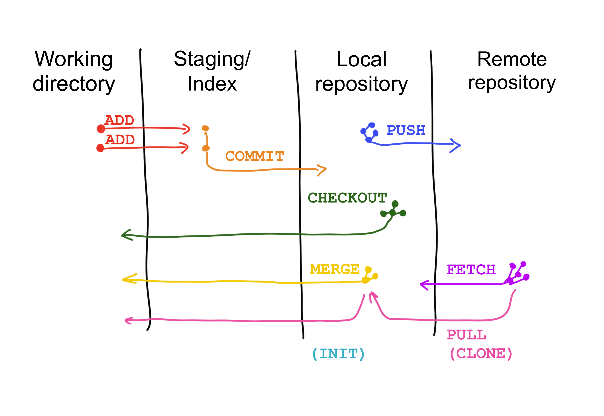
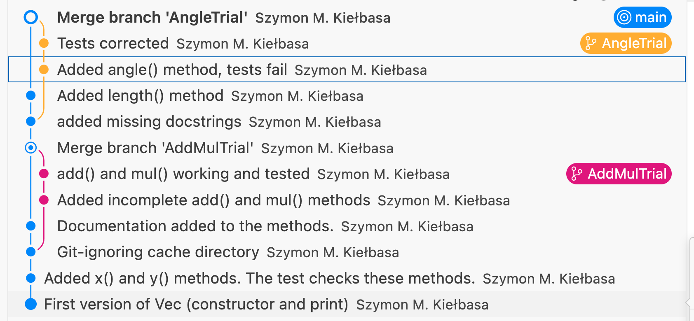

# Git: Branching and merging

## Outline

- Understand git storage model:
  - working tree/working directory
  - staging area/index
  - local repository
  - remote repository
  - understand git operations: add, commit, checkout, push, pull, fetch
- Understand git branching and merging:
  - commit graph (history)
  - labels (HEAD, branch names, tags)
  - how a commit is added to the graph
  - switching branches
  - merging branches
  - conflict resolution
- Follow an example of developing a class in Python script with intensive use of git

## Git

[Git@wikipedia](https://en.wikipedia.org/wiki/Git):

- Git is a tool for managing changes in files (i.e. history) of a project.
- Git allows "coordinating work among programmers collaboratively developing source code during software development".

## Git storage model

- **Working directory**:
  - A folder on your computer with the files/subfolders you are working on.
- **Staging area (index)**:
  - A place where you (temporarily) `add` changed files from the working directory before you `commit` them to the local repository.
- **Local repository**:
  - A folder on your computer where git stores the (complete) history of changes ever made to the files of the project; this folder is usually called `.git` and is hidden in the working directory.
  - Using `checkout` operation you may always reconstruct the state of the working directory at any point in the history of the project.
  - Using `init` command you can create a new, empty local repository. Normally this will also create a new working directory.
- **Remote repository** (optional): 
  - A folder, usually on a server (e.g. GitHub), where another copy of the history of the project is kept. 
  - Usually, this repository can be accessed by other users to collaborate on the project. The users can `push` changes from their local repositories to the remote repository. They can also and `pull`/`fetch` changes from the remote repository to their local repository.
  - Using `clone` command you can create a local repository with the content taken from a remote repository. This will also create a working directory with the newest version of the files in the project.

Note:

- When changes are made in the working directory, git does not store them automatically in the repository. The user has to decide which files to snapshot and when to perform this action.
- Git is a distributed version control system: The entire history of a project is stored on every computer which has the repository of the project. No computer (server) with a central role is needed.
- When you work on the same project on different computers, you can use git and the remote repository to synchronize the changes between the computers.

## Git branching and merging

- Git organizes the history of changes in a project as a directed acyclic graph (DAG):
  - Each commit is a node in the graph and each commit has a unique ID (hash).
  - Each commit points to a parent commit (the commit which was the last one before the current one).
- Branches:
  - In theory, a new commit can be added to any commit in the graph. However, in practice, we usually add new commits to the last commit of a branch.
  - A branch is a name of (a pointer to) the last commit in the branch.
  - Once a new commit is added to the branch, the branch name is updated to point to the new commit.
  - `HEAD` defines the current branch; a new commit will be added there. In VSCode, `HEAD` is shown as a three concentric circles.
  - Using `checkout` command you can switch to another branch. This will change the working directory to the state of the files in that branch.
- Branch names:
  - The main branch is usually called `main` or `master`.
  - It is a good practice to always keep the main branch stable (working).
  - New, incomplete features should be developed in separate branches. Once the feature is finished, you can `merge` it into the main branch.
  - Use short, descriptive names for branches.
- Merging branches:
  - Merging is the process of incorporating changes from another branch into the current branch.
  - When merging, git will try to automatically resolve the changes. This process will be successful if there are no changes in both branches in the same lines of the file.
  - In case of conflicts, git will mark the conflicting lines in the file and you will have to resolve them manually.
  - After merging, the branch which was merged can be deleted.

## Live demo example

During the lecture we will be developing two files: one with definition of a class, and another one with some tests of the class:

- We will be using git to manage the changes in the files.  
- We will only use the local repository, and we will create some branches to develop new features.  
- We will study a merge without conflicts and a merge with conflicts.

[Notes for the demo](git_live_demo_plan.md).

[Old materials with the exercises](git_branching_merging_old.md).