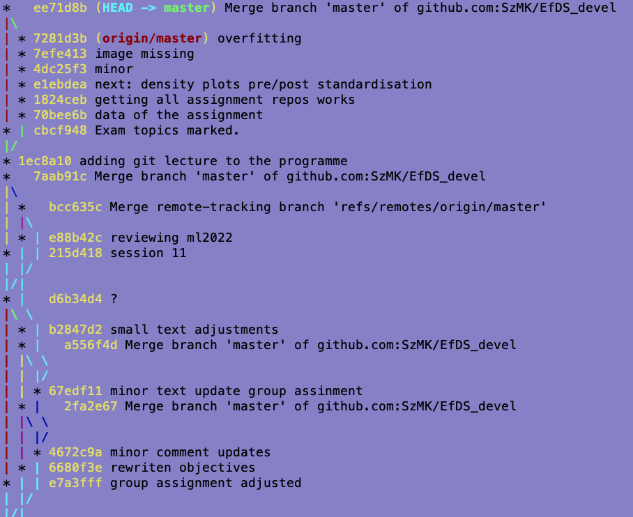

# Git: Branching and merging

## What is git

[Git@wikipedia](https://en.wikipedia.org/wiki/Git):

- Git is a tool for managing changes in files (i.e. history) of a project.
- Git allows "coordinating work among programmers collaboratively developing source code during software development".
- Git is a distributed version control system: the entire history of the project is stored on every computer and no computer (server) with a central role is needed.

When you use git you have:

- A *working directory*: a folder on your computer with the files/subfolders you are working on.
- A *local repository*: a folder on your computer where git stores the history of the project; this folder is usually called `.git` and is hidden in the working directory.
- A *staging area (index)*: a place where you *add* changes from the working directory before you *commit* them to the local repository.

Typical starting points for a git project:

- *A completely new project*: 
  - You create a new working directory and you initialize a new repository in it (`git init`).
  - You then add files to the working directory and commit them to the local repository.
  - You can then associate your git repository with a newly created remote repository (e.g. on GitHub, `git remote add...`) and `git push` your commits to it.
- *An existing project without a repository*:
  - You initialize a new repository in the working directory (`git init`).
  - Then proceed as above.
- *An project already existing in an external repository*:
  - You clone the external repository to your computer (`git clone...`). 
  - The cloning process creates a working directory with the newest state of the project and with a full copy of the history in the local repository.
  - The location of the remote repository is stored in the local repository and is called `origin` (check with `git remote -v`).

#### Exercises

*Hint:* Open separate terminals for each of the following exercises.

##### New project (`new_proj_test`)

Create a new local directory named `new_proj_test` and initialize a git repository in it. Go to the newly created directory. Use `git status` to confirm that you indeed created the repository. Find the hidden `.git` directory in the working directory.

```bash
# SOLUTION 1:
# cd to the directory where you want to create the new directory
mkdir new_proj_test
cd new_proj_test
git init
git status
```

```bash
# SOLUTION 2:
# cd to the directory where you want to create the new directory
git init new_proj_test
cd new_proj_test
git status
```

##### Cloned project (EfDS materials, `efds_test`)

Go to the [GitHub top page of this course](https://github.com/LUMC/EfDS/). Find the HTTPS clone URL of the repository. Clone the repository to your computer into a directory `efds_test`. Go to the newly created directory. Use `git status` to confirm that you indeed created the repository. Find the hidden `.git` directory in the working directory.

```bash
# cd to the directory where you want to create the new directory
git clone https://github.com/LUMC/EfDS efds_test
cd efds_test
git status
```

## What is a commit

A *commit object* in the git repository describes a snapshot of the state of the project working directory at a certain point in time. It contains the following information:

- The contents of the project files at the time of the commit.
- A pointer to a parent commit (`HEAD`) that came directly before this commit (when merging a commit can have two parent commits).
- The time, author and *message* of the commit.
- A unique identifier (*hash*) for the commit.

The commit objects form a directed acyclic graph which represents the evolution of the project files. Here is an example of a commit graph generated by GitHub (which also shows forks of the project):

- https://github.com/LUMC/EfDS/network

Here is a command-line version of a commit graph (as stored in the local repository):

- The newest commit is at the top. Stars denote commits.
- The chart was generated with `git log --graph --oneline --all` command.



Notes:

- Only files that have changed are stored in the commit object. Also, the changes (diffs) are stored, not the entire files.
- The committed objects/files are immutable - they will stay in the repository forever.
- The committed objects/files are stored in the `.git/objects` directory.
- A working directory might contain files that are not in the commit object (they need to be added and committed first).
- A working directory might contain less files than stored in the local repository (files from the working directory which were "committed to be removed" are still kept in the local repository).
- The commit object does not contain the name of the branch it is on.

#### Exercises

##### Cloned project (EfDS materials, `efds_test`): study the history

Go to the `efds_test` directory:

- Use `git log` to see the history of the project. 
- Use `git log --graph --oneline --all --decorate` to see the history of the project in a graph. 
- What is the hash of the newest commit?
- Find the hash of the commit corresponding to the message `Exam topics marked.`
- Read how to use `git diff` to show differences between two commits. Use it to show the differences between the commit with `Exam topics marked.` message and the parent.
- The same information can be found on the GitHub page of the repository at the *NN commits* link. Find the commits log and how to show the differences introduced by a commit.

```bash
git log
git log --graph --oneline --all --decorate
git diff 25a4db7 25a4db7^
git diff HEAD HEAD~        # last vs one-before last
git diff HEAD HEAD~3       # last vs three-before last
```

##### Cloned project (EfDS materials, `efds_test`): go to the past and back again

Go to the `efds_test` directory:

- Find how to use `git checkout` to go back to the parent of the commit with the message `Exam topics marked.`. 
- Use `git status` to see the state of the working directory.
- Use `git log --graph --oneline --all --decorate` to see the history of the project in a graph.
- Look into the `README.md` file. Confirm that you see the version of the file from the parent commit.
- Use `git checkout main` to go back to the newest commit.
- Use `git status` to see the state of the working directory.
- Look into the `README.md` file. Confirm that you see the version of the file from the parent commit.

```bash
git checkout 25a4db7^
git status
git log --graph --oneline --all --decorate
# check README.md whether the past version
git checkout main
git status
git log --graph --oneline --all --decorate
# check README.md whether the newest version
```

## What is a branch


Study again the image:

- Starting from the commit `1ec8a10` there were two evolution paths (*branches*) of the project:
  - one leading to the commit `cbcf948`
  - another leading to the series of commits `70bee6b...7281d3b`
- Both paths were *merged* in the commit `ee71d8b`.

Notes:

- Commits have no names, only hashes. Commits remember only their parents (past), not their children (future). Given such data, there is no simple way to find the newest commit.
- Therefore, another mechanism must exist to find the newest commits. This is done by naming branches. *Branches* are just user-defined names (e.g. `main`/`master`) which point to commits and move along with the commits when new commits are added to them.
- The commit denoted by `HEAD` is the one to which a new commit will be added when you use `git commit` command.
- The commit denoted by `master` is the newest commit in its branch known to the local repository.
- The commit denoted by `origin/master` is the newest commit in its branch known to the remote (`origin`) repository. A `git push` operation will update this commit.

#### Exercises

##### New project (`new_proj_test`): branching and merging

1. *Create a file in the repository.*  
    - Go to the `new_proj_test` directory and create a file `pattern.py` with the contents given below.
    - Check that the code works and prints a square pattern.
    - Add the file to the repository and commit the changes.
    - Check the history of the project with `git log --graph --oneline --all --decorate`

```python
def printSquare(n):
    for r in range(n):
        for c in range(n):
            if r == 0 or r == n - 1 or c == 0 or c == n - 1:
                print('*', end='')
            else:
                print(' ', end='')
        print()

printSquare(5)
```

2. *Start a new `feature` branch.*  
Let's assume that a new feature is planned for the project: a function that prints X shape. This feature will be developed in a separate branch `feature`. The `main` (`master`) branch will be used for the stable (always well working) version of the project.  
    - Use `git branch` to see the list of available branches (`*` denotes the current branch).
    - Use `git branch feature` to create a new branch.
    - Use `git branch` to see the list of branches.
    - Study `git log --graph --oneline --all --decorate` to see how branch information is presented.
    - **Note:** the `HEAD` pointer is still on the `main` branch. If you add something to the project, it will be added to the `main` branch.
    - Use `git checkout feature` to switch to the new branch.
    - Use `git branch` to confirm that you are now on the `feature` branch.
    - Use `git log --graph --oneline --all --decorate` to confirm that you are now on the `feature` branch.
    - Now add the `printX` function to the `pattern.py` file. The code is given below.
    - Add the file to the repository and commit the changes.
    - Check the history of the project with `git log --graph --oneline --all --decorate` (ensure that you understand the locations of `HEAD`, `feature` and `main`/`master`).

```python
def printX(n):
    for r in range(n):
        for c in range(n):
            if r == c or r == n - 1 - c:
                print('*', end='')
            else:
                print(' ', end='')
        print()

printX(7)
```

3. *Urgent change in the `main`/`master` branch.*  
Let's assume that an urgent change needs to be made in the `main`/`master` branch. Let's aso assume that the `feature` branch is not yet ready to be merged into the `main`/`master` branch.
   - Use `git branch` to see the list of branches.
   - Use also `git status` to see the current branch.
   - Use `git checkout` to switch to the `main`/`master` branch.
   - Verify that you are now on the `main`/`master` branch. Check location of `HEAD` in the commit graph.
   - Introduce a change in the `pattern.py` file. Let's pretend that the urgent correction is to change the name of the argument of the `printSquare` function from `n` to `size`. The code is given below.
   - Use `git diff` to see the changes before adding them to the repository.
   - You are about to modify the `main`/`master` branch - be sure that the code works (let's pretend that other developers may be using the `main`/`master` code).
   - Add the file to the repository and commit the changes. Study the commit graph.
 
```python
def printSquare(size):
    for r in range(size):
        for c in range(size):
            if r == 0 or r == size - 1 or c == 0 or c == size - 1:
                print('*', end='')
            else:
                print(' ', end='')
        print()

printSquare(5)
```

4. *Merge the `feature` branch into the `main`/`master` branch.*  
Let's assume now that it has been decided that the `feature` branch is ready to be merged into the `main`/`master` branch.
    - Confirm that you are on the `main`/`master` branch.
    - Use `git merge feature` to merge the `feature` branch into the current branch.
    - The merge might be successful or it may lead to conflicts:
        - A conflict happens when the same lines of the same files were modified in different branches. You need then to manually correct the conflicts (open each file and edit it so the code is correct). After that, you need to `git add` the files to the repository and `git commit` the changes.
        - When there are no conflicts, the merge is done automatically. You will be asked for a commit message. Use the default one.
    - Use `git log --graph --oneline --all --decorate` to see the history of the project in a graph. Ensure that you understand the locations of `HEAD`, `feature` and `main`/`master`. Your current branch is `main`/`master`. The `feature` branch is merged into the `main`/`master` branch but it is still there. It can be either deleted (`git branch -d feature`) or used for further development.

```
*   28277f9 (HEAD -> master) Merge branch 'feature'
|\  
| * c63d595 (feature) added printing of X
* | 01a7ede Changed argument name
|/  
* d689bf2 first file
```

## What are these hashes

### From a file to a hash

- The hash is calculated quickly from the contents of a given file.
- It is hard to reverse the process: it is very time-consuming to create a file which would produce a given hash.
- It is unlikely that two different files will have the same hash.
- Therefore, if two files have different hashes, they can be assumed to be different (e.g. slightly changed).
- Therefore, the hash can be used as a unique identifier of the file.

```bash
# Generates hash of the current version of README.md
git hash-object README.md
```

### How git uses hashes

- Git can be considered as a key-value store: the value is content of a file, the key is the hash of the file.

Here is an example of a file describing a commit:

```bash
# Find the hash of the newest commit (here: c4b6...)
git log --pretty=oneline | head -n 1
# Print the file corresponding to the hash
git cat-file -p c4b6c27f47c460c360d613a21cd36d487909c302
```

The hash corresponding the `tree` describes the top-level directory of the project:

```bash
git cat-file -p 59fb2c4985792cc8f7f5cccdf3dc8ed85a7864e4
```

Finally, hashes corresponding to `blob`s contain the contents of the files:

```bash
git cat-file -p e7164afe2090dd9f4f0d0a285b13c6d6069e72cd
```

## Further reading (watching)

- Examples of the commit graph in a large project:
    - *Python pandas*: https://github.com/pandas-dev/pandas/network
    - *R ggplot2*: https://github.com/tidyverse/ggplot2/network
- Common branching strategies:
    - https://www.youtube.com/watch?v=gW6dFpTMk8s